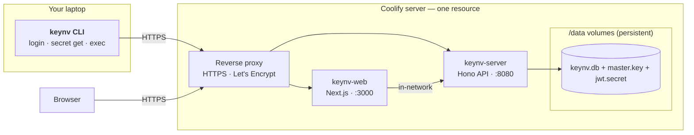

# Deploy keynv on Coolify

Self-host keynv — the API server **and** the web dashboard — as one Coolify
resource. The CLI on your laptop talks to the API over HTTPS; encrypted
secrets live in a persistent SQLite file.

|              |                                                              |
| ------------ | ------------------------------------------------------------ |
| **Time**     | ~15 minutes — most of it waiting on the first Docker build   |
| **Result**   | `https://<your-domain>` (the panel) + `https://api.<your-domain>` (the API/CLI) |
| **You need** | A Coolify v4+ instance and one or two subdomains. No `openssl`, no secret generation — keynv makes its own keys |

> [!NOTE]
> One resource runs both services (`deploy/coolify.yml`). If you only use the
> CLI, just skip the web domain in Step 4 — the server runs fine on its own.

---

## Architecture



Coolify clones this repo, builds both images from `deploy/coolify.yml`, runs
the containers, and proxies your subdomain(s). No GitHub Actions, registry,
Helm chart, S3, or Litestream is load-bearing for the deploy.

---

## Prerequisites

| | |
|---|---|
| **Coolify** | v4+ instance you can sign into |
| **Server** | 1 vCPU · 2 GB RAM · 10 GB free disk (build is the spike — native compile of better-sqlite3/argon2 wants ≥1 GB) |
| **DNS** | `A` record for `api.<your-domain>` → Coolify server IP. Add a second `A` for `<your-domain>` (apex) if you want the web dashboard. Cloudflare users: leave the proxy (orange cloud) OFF until Let's Encrypt issues certs. |
| **Repo access** | This repo reachable from Coolify (public works; private needs a connected GitHub source) |

---

## Step 1 — Create the resource

1. **Project → New Resource → Docker Compose Empty** (or _From Git Repository_
   for auto-redeploy on push to `main`).
2. **Source:** the connected GitHub source pointing at this repo.
3. **Branch:** `main`.
4. **Compose file path:** `deploy/coolify.yml`.

Save. Don't deploy yet — set the owner account first.

---

## Step 2 — Set the owner account

In the resource's **Environment Variables** tab, set the **only two values you
must provide**:

| Key | Value | Mark as secret? | Why |
|---|---|:-:|---|
| `KEYNV_BOOTSTRAP_OWNER_EMAIL` | your login email | — | The first user account, created on first boot |
| `KEYNV_BOOTSTRAP_OWNER_PASSWORD` | a 12+ char password | ✓ | Your owner login (Argon2id-hashed). Must be ≥ 12 chars |

Everything else is optional and auto-generated on first boot:

- **JWT secret**, **master key**, and the **web session secret** are generated
  and persisted on the volumes — nothing to create by hand.
- `KEYNV_BOOTSTRAP_ORG_NAME` (default `default`), `KEYNV_PUBLIC_REGISTRATION`
  (default `false`), `KEYNV_LOG_LEVEL` (default `info`) can be set if you want.

### How the owner bootstrap works

On every boot the server ensures its master key + JWT secret exist (generating
them the first time), then:

| An org already exists? | Bootstrap vars set? | Result |
|---|---|---|
| no | yes | Creates the org + owner |
| no | no / password < 12 | **Boots anyway**, logs a warning; set the vars and restart, or register the first user from the panel |
| yes | (ignored) | Steady state — a no-op |

Missing or invalid bootstrap vars **never crash-loop the server** — it always
starts; you just can't log in until an owner exists.

> [!TIP]
> After Step 5 verifies success, blank out `KEYNV_BOOTSTRAP_OWNER_PASSWORD`.
> Owner creation is skipped once an org exists, so removing it is safe.

---

## Step 3 — Point domains at it

In the resource's **Domains** tab, map each service:

| Service | Domain | Container port |
|---|---|---|
| `keynv-web` | `https://<your-domain>` | `3000` |
| `keynv-server` | `https://api.<your-domain>` | `8080` |

Coolify provisions Let's Encrypt certs automatically once DNS resolves. If you
only use the CLI, map just `keynv-server` and skip the web domain.

> [!TIP]
> Set `KEYNV_WEB_URL` to `https://<your-domain>` on the resource so the API
> knows the public web origin (CORS/redirects). On a single host the web
> reaches the API in-network via the default `KEYNV_SERVER_URL`.

---

## Step 4 — Deploy

Click **Deploy**. Coolify will:

1. Clone `main`, build both images (3–6 min first time — native compile)
2. Start `keynv-server`; on first boot it generates the master key + JWT
   secret and (with the bootstrap vars set) creates the org + owner
3. Start `keynv-web` once the server healthcheck (`GET /v1/health/ready`) is green
4. Route your domain(s) to the containers

Server deploy log (pino JSON, trimmed):

```text
msg: "initializing fresh deployment — creating owner + org"
msg: "created org"   orgName: "default"
msg: "created owner" email: "you@example.com"
keynv-server listening on http://localhost:8080
```

If you don't see those lines, jump to [Troubleshooting](#troubleshooting).

---

## Step 5 — Back up the master key OFF-HOST

> [!CAUTION]
> **Do this immediately.** Lose the master key **and** the database, and no
> backup recovers anything — DB backups deliberately exclude the key, so a
> leaked DB backup is worthless without it. That only holds if you keep the
> key somewhere keynv itself doesn't run.

Open the Coolify **Terminal** for the `keynv-server` container:

```bash
cat /data/master.key | base64
```

Copy the base64 into your password manager (`keynv master.key — backup`).
Don't email it, don't commit it, don't store it on the same Coolify server.

<details>
<summary><b>Restore later</b> (new server, lost volume)</summary>

```bash
echo '<base64-from-password-manager>' | base64 -d > /data/master.key
chmod 600 /data/master.key
```
Restart the container; the server reads the key on boot and resumes decrypting.
</details>

---

## Step 6 — Verify

From your laptop:

```bash
# The readiness probe Coolify gates on — 503 until the DB is up, then 200:
curl https://api.<your-domain>/v1/health/ready
# {"ok":true,"version":"...","db":"ok",...}
```

Then open `https://<your-domain>` — the login page renders. Log in with the
owner account from Step 2.

> [!TIP]
> Now blank out `KEYNV_BOOTSTRAP_OWNER_PASSWORD` in Coolify's env-var UI —
> owner creation is skipped once the org exists, so it just keeps the password
> out of the deployment config.

---

## Step 7 — Connect the CLI

On your laptop:

```bash
npm install -g @keynv/cli
keynv
# choose Self-hosted server, enter https://api.<your-domain>, complete browser auth

# smoke test
keynv project create demo
keynv secret create @demo.dev.test --value 'hello-from-coolify'
keynv secret get @demo.dev.test --copy    # copies to clipboard; drop --copy to print
```

All three working means the deployment is done.

> [!NOTE]
> On a headless Linux box without an OS keychain (libsecret), export
> `KEYNV_DISABLE_KEYCHAIN=1` before `keynv login` — the CLI then stores its
> encrypted credentials in a file instead of the system keychain.

---

## Updating

Push to `main` → enable _Auto Deploy on Push_, or click **Deploy**. Migrations
run on every container boot; the `keynv-data` / `keynv-web-data` volumes
survive redeploys, so your DB, keys, and audit log persist.

---

## Backups (optional)

| Option | Setup |
|---|---|
| **Litestream** | Real-time WAL replication to S3/B2. Enable the `backup` profile on the plain-Compose stack (`deploy/docker-compose.yml`), or run it as a separate Coolify resource mounting `/data` read-only |
| **Volume snapshot** | Coolify's built-in periodic backups under _Server → Backups_ |

> [!CAUTION]
> Never put the master key in the same backup as the DB — the encryption story
> depends on that separation. Your password-manager copy from Step 5 is enough.

The full restore drill lives in
[`docs/backup-restore-runbook.md`](../docs/backup-restore-runbook.md).

---

## Troubleshooting

| Symptom | Likely cause | Fix |
|---|---|---|
| Can't log in; server is healthy | No owner account created | Set `KEYNV_BOOTSTRAP_OWNER_EMAIL` + `KEYNV_BOOTSTRAP_OWNER_PASSWORD` (≥12 chars) and redeploy. Check the deploy log for the warning |
| Build fails on `pnpm install` | Lockfile out of sync | `pnpm install` locally, commit `pnpm-lock.yaml`, redeploy |
| `/v1/health/ready` returns 503 with `"db":"error"` | Volume not persisted | Confirm `keynv-data` is mounted at `/data` in the resource UI |
| TLS cert provisioning fails | DNS not propagated, or Cloudflare proxy on | `dig api.<your-domain>` to confirm it resolves to the Coolify IP; set the record DNS-only (grey cloud) until the cert issues |
| Build runs out of memory | better-sqlite3 + argon2 native compile is RAM-hungry | Bump build RAM to ≥ 1 GB; runtime needs ~256 MB |
| Login returns 401 with the right password | Wrong owner email recorded | Coolify Terminal: `sqlite3 /data/keynv.db 'SELECT email FROM users'` |

---

<details>
<summary><b>What this guide deliberately doesn't cover</b></summary>

- **HA / multi-region** — single container, single SQLite. Comfortably handles
  a 15-person team. Beyond ~50 users, see the Postgres adapter plan in
  [`docs/roadmap.md`](../docs/roadmap.md).
- **CI/CD** — this repo's GitHub Actions live in `.github/workflows/` (CI,
  release, security). They're not required for a Coolify deploy.
</details>
