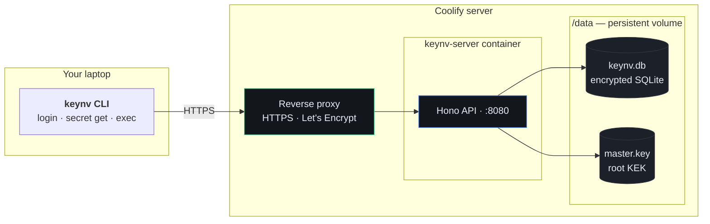

# Deploy keynv on Coolify

Self-host the keynv API behind your Coolify instance. The CLI on your laptop
talks to it over HTTPS; encrypted secrets live in a persistent SQLite file.

|              |                                                              |
| ------------ | ------------------------------------------------------------ |
| **Time**     | ~15 minutes — most of it waiting on the first Docker build   |
| **Result**   | `https://api.<your-domain>` answering CLI logins; optional web dashboard at `https://<your-domain>` |
| **You need** | A Coolify v4+ instance, a subdomain (or two — one for API, one for the web UI), and `openssl` on a Mac/Linux box |

> [!NOTE]
> This guide deploys the **API server** first (the CLI's only hard dependency).
> Step 9 at the end walks through adding the **web dashboard** as a second
> Coolify resource — skip it if you only use the CLI.

---

## Architecture



Coolify clones this repo, builds the image with `apps/server/Dockerfile`, runs
the container, and proxies your subdomain to port `8080`. You don't need
GitHub Actions, a registry, a Helm chart, S3, or Litestream — none of it is
load-bearing for the deploy.

---

## Prerequisites

| | |
|---|---|
| **Coolify** | v4+ instance you can sign into |
| **Server** | 1 vCPU · 1 GB RAM · 10 GB free disk (less is fine at runtime; build is the spike) |
| **DNS** | An `A` record for `api.<your-domain>` pointing at the Coolify server's public IP. Add a second `A` for `<your-domain>` (apex) if you also want the web dashboard from Step 9. Cloudflare users: leave the proxy (orange cloud) OFF until Let's Encrypt issues the certs. |
| **Repo access** | This repo reachable from Coolify (public works; private repos need a connected GitHub source) |

---

## Step 1 — Generate two secrets, locally

Run on your laptop (Node.js is a prerequisite — `node -e` works on all platforms):

```bash
# (a) JWT signing secret — server signs every CLI access token with this
node -e "console.log(require('crypto').randomBytes(48).toString('base64'))"

# (b) Owner login password — what YOU will type into `keynv login`
node -e "console.log(require('crypto').randomBytes(24).toString('base64'))"
```

> [!IMPORTANT]
> Save both into your password manager **before** continuing. The JWT secret
> you'll never see again, and rotating it later signs every existing CLI
> session out. The owner password is your front-door login.

> [!NOTE]
> A third secret — the **master encryption key** that wraps every project's
> data-encryption key — isn't created here. The server generates it inside
> the container on first start, and you'll back it up off-host in **Step 6**.

---

## Step 2 — Create the resource in Coolify

1. **Project → New Resource → Docker Compose Empty** (or _From Git Repository_
   if you want auto-redeploy on every push to `main`).
2. **Source:** the connected GitHub source pointing at this repo.
3. **Branch:** `main`.
4. **Compose file path:** `deploy/coolify.yml`.

Save. Don't deploy yet — environment variables come next, and the server
needs them on first start.

---

## Step 3 — Set environment variables

In the resource's **Environment Variables** tab:

| Key | Value | Mark as secret? | Why it matters |
|---|---|:-:|---|
| `KEYNV_JWT_SECRET` | the 48‑byte value from Step 1 | ✓ | Server signs/verifies CLI access tokens |
| `KEYNV_BOOTSTRAP_OWNER_EMAIL` | your login email | — | First user account auto-bootstrap creates |
| `KEYNV_BOOTSTRAP_OWNER_PASSWORD` | the 24‑byte value from Step 1 | ✓ | Your `keynv login` password (Argon2id-hashed). 12+ chars |
| `KEYNV_BOOTSTRAP_ORG_NAME` | e.g. `acme` | — | Org name attached to the owner. Optional, defaults to `default` |
| `KEYNV_PUBLIC_REGISTRATION` | `true` (Cloud) / `false` (self-host) | — | Opens `POST /v1/auth/register` so anyone can sign up. Leave `false`/blank unless you're running a public Cloud-style instance |
| `KEYNV_LOG_LEVEL` | `info` | — | Set to `debug` while troubleshooting |

### How the BOOTSTRAP_* vars work

The server checks for `/data/master.key` on every start.

| Master key | Bootstrap vars | What happens |
|---|---|---|
| **missing** | **set** | Auto-bootstrap fires: generate key, run migrations, create org + owner |
| **present** | (ignored) | Steady state — bootstrap is a no-op on every restart |
| **missing** | unset | Server fails fast with a clear error in the log |

> [!TIP]
> After Step 7 verifies success, blank out `KEYNV_BOOTSTRAP_OWNER_PASSWORD`.
> Clearing it is safe because the bootstrap branch becomes unreachable once
> the master key file exists.

---

## Step 4 — Point a domain at it

In the resource's **Domains** tab:

- **Domain:** `https://api.<your-domain>`
- **Port:** `8080` (the container's exposed port)

Coolify's reverse proxy provisions a Let's Encrypt cert automatically. If the
DNS `A` record for `api.<your-domain>` isn't already pointing at the Coolify
server, add it now — TLS provisioning fails until DNS resolves.

---

## Step 5 — Deploy

Click **Deploy**. Coolify will:

1. Clone the repo at `main`
2. Build via `docker compose -f deploy/coolify.yml build` (3–5 min first time — Node + better-sqlite3 / argon2 native compile)
3. Start the container
4. Auto-bootstrap fires (master.key missing, vars set) → key generated, migrations applied, org + owner inserted
5. Server starts listening on `:8080`
6. Healthcheck (`GET /v1/health` → 200) flips green
7. Reverse proxy routes `https://api.<your-domain>` → container `:8080`

You should see this in the deploy log:

```text
[auto-bootstrap] master key missing — initializing fresh deployment
[auto-bootstrap] created org "acme" (id=org_...)
[auto-bootstrap] created owner you@example.com (id=u_...)
keynv-server listening on http://localhost:8080
```

If you don't see those lines, jump to [Troubleshooting](#troubleshooting).

---

## Step 6 — Back up the master key OFF-HOST

> [!CAUTION]
> **Do this immediately. Not after lunch.** Lose the master key **and** the
> database, and no backup recovers anything. The system is designed this way
> on purpose — DB backups and Litestream replication deliberately exclude
> the key, so a leaked DB backup is worthless without it. That guarantee
> only works if you keep the key somewhere keynv itself doesn't run.

Open the Coolify **Terminal** for the keynv-server resource:

```bash
cat /data/master.key | base64
```

Copy the base64 output into your password manager under a clear label
(`keynv master.key — backup`). Don't email it, don't put it in this repo,
don't store it on the same Coolify server.

<details>
<summary><b>Restore later</b> (new server, lost volume)</summary>

Write the base64-decoded bytes back to `/data/master.key` on a fresh
container that has the matching restored DB:

```bash
echo '<base64-from-password-manager>' | base64 -d > /data/master.key
chmod 600 /data/master.key
```

Restart the container. The server reads the key on boot and resumes
decrypting secrets.
</details>

---

## Step 7 — Verify

From your laptop:

```bash
curl https://api.<your-domain>/v1/health
# {"ok":true,"version":"...","db":"ok"}
```

If you get that JSON back, the server is fully up. Healthcheck green in
Coolify confirms it.

> [!TIP]
> Now is a good moment to blank out `KEYNV_BOOTSTRAP_OWNER_PASSWORD` in
> Coolify's env-var UI. The bootstrap branch is unreachable now that the
> master key exists, so removing the var won't break anything — it just
> keeps the password out of the deployment config.

---

## Step 8 — Connect the CLI

On your laptop:

```bash
keynv config set server-url https://api.<your-domain>
keynv login --email you@example.com
# paste the owner password from Step 1

# smoke test
keynv project create demo
keynv secret create @demo.dev.test --value 'hello-from-coolify'
keynv secret get @demo.dev.test
# → hello-from-coolify
```

All three commands working means the deployment is done. Start using it for
real secrets.

---

## Step 9 — Deploy the web dashboard (optional)

The web UI is its own Coolify resource, separate from the API server. Skip
this if you only use the CLI. The web app holds no state — it just talks to
`api.<your-domain>` over HTTPS the same way the CLI does.

### DNS

Add an `A` record for the apex you'll serve the dashboard from (e.g.
`<your-domain>` → Coolify server IP). Cloudflare proxy off until Let's Encrypt
issues the cert.

### Coolify resource

1. **Project → New Resource → Docker Compose Empty** (or _From Git_ if you
   want auto-redeploy on push).
2. **Source:** same repo, branch `main`.
3. **Compose file path:** `deploy/coolify-web.yml`.
4. **Environment Variables:**

   | Key | Value | Mark as secret? | Why it matters |
   |---|---|:-:|---|
   | `KEYNV_SERVER_URL` | `https://api.<your-domain>` (from Step 4) | — | Where the web container fetches the API |
    | `KEYNV_WEB_SESSION_SECRET` | `node -e "console.log(require('crypto').randomBytes(48).toString('base64'))"` | ✓ | Encrypts the session cookie that wraps the user's access token |

5. **Domains:** `https://<your-domain>` → container port `3000`.
6. **Deploy.** First build is 3–5 min (Next.js standalone compile).

### Verify

```bash
# Healthcheck — login page renders
curl -I https://<your-domain>/login    # → 200

# Open in a browser
Visit `https://<your-domain>` in your browser — the login page renders.
```

If `KEYNV_PUBLIC_REGISTRATION=true` was set on the **server** resource, the
`/register` route is live and anyone can sign up. Otherwise log in with the
owner account from Step 1 and invite users from `/admin/users`.

> [!TIP]
> The web resource shares no volumes or network with the server resource.
> Redeploying one doesn't restart the other — useful when iterating on the
> dashboard without nudging a live API.

---

## Updating

When you push commits to `main`:

- **Auto:** enable _Auto Deploy on Push_ in the resource settings if you used
  the Git source. Every push to `main` triggers rebuild + redeploy.
- **Manual:** click **Deploy** in the resource UI.

Drizzle migrations run on every container boot, so schema changes ship with
the code. The `keynv-data` volume survives redeploys, so your DB, master key,
and audit log persist.

---

## Backups (skip until you actually want them)

Two options, both add later:

| Option | Pros | Setup |
|---|---|---|
| **Litestream sidecar** | Real-time WAL replication to S3 / B2; minute-level RPO | Spin up a second Coolify resource using the litestream service from `deploy/docker-compose.yml`, mounting the same `/data` volume read-only |
| **Volume snapshot** | No S3 setup; works with any object store rclone supports | Coolify's built-in periodic backups under _Server → Backups_. Less granular than Litestream |

> [!CAUTION]
> Whichever you pick: **never** put the master key in the same backup as the
> DB. The whole encryption story depends on those being separated. Your
> password manager copy from Step 6 is enough.

---

## Troubleshooting

| Symptom | Likely cause | Fix |
|---|---|---|
| Build fails on `pnpm install` | Lockfile out of sync | `pnpm install` locally, commit `pnpm-lock.yaml`, redeploy |
| Server crash-loops on first deploy | Bootstrap env vars missing or password under 12 chars | Re-check Step 3, redeploy |
| `KEYNV_JWT_SECRET: String must contain at least 32 character(s)` | JWT secret too short | Use `node -e "console.log(require('crypto').randomBytes(48).toString('base64'))"`, redeploy |
| `/v1/health` returns 500 with `"db":"error"` | Volume not persisted between restarts | Confirm the `keynv-data` volume is mounted at `/data` in the Coolify resource UI |
| TLS cert provisioning fails | DNS not propagated, or Cloudflare proxy is on | Wait 5–30 minutes, then `dig api.<your-domain>` to confirm the `A` record resolves to the Coolify IP. If using Cloudflare, set the record to DNS-only (grey cloud) until the cert issues |
| Build runs out of memory | better-sqlite3 + argon2 native compile is RAM-hungry | Bump build-time RAM to ≥ 1 GB; runtime needs only ~256 MB |
| Login returns 401 with the right password | Wrong owner email recorded, or DB / env mismatch | Coolify Terminal: `sqlite3 /data/keynv.db 'SELECT email FROM users'`. If the email is wrong, the only clean fix is to wipe `/data/*` and redeploy — this loses all data |

---

<details>
<summary><b>What this guide deliberately doesn't cover</b></summary>

- **HA / multi-region** — single container, single SQLite. Comfortably
  handles a 15-person team. Beyond ~50 users, see the Phase 6 Postgres
  adapter plan in [`docs/roadmap.md`](../docs/roadmap.md) (Phase 6).
- **GitHub Actions / signed releases** — paused in
  `.github/workflows.disabled/` during this personal-use phase. They come
  back before any public OSS launch.
</details>
