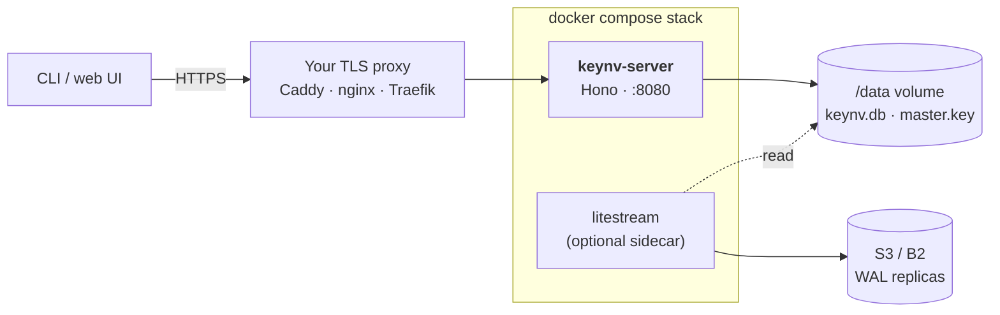

# Self-host deployment

Two supported paths. Pick whichever matches how you operate.

|                  | Coolify ([guide](./COOLIFY.md))                | Plain Docker Compose (this guide)        |
| ---------------- | ---------------------------------------------- | ---------------------------------------- |
| **Best when**    | You already run Coolify or want HTTPS handled  | You want full control over the host      |
| **Time**         | ~15 minutes                                    | ~10 minutes + your own TLS proxy         |
| **HTTPS**        | automatic (Coolify proxy + Let's Encrypt)      | bring your own (Caddy / nginx / Traefik) |
| **Auto-deploy**  | optional, on push to `main`                    | manual `docker compose pull && up -d`    |

> [!TIP]
> If both paths work for you, use Coolify — it removes the TLS proxy step
> and the manual update flow.

---

## What this stack runs



---

## First-time bring-up

```bash
# 1. configure
node -e "require('fs').copyFileSync('deploy/.env.example','deploy/.env')"
# Then open deploy/.env in your editor
```

Required values in `deploy/.env`:

| Key | How to fill |
|---|---|
| `KEYNV_JWT_SECRET` | `node -e "console.log(require('crypto').randomBytes(48).toString('base64'))"` |
| `KEYNV_BOOTSTRAP_OWNER_EMAIL` | your login email |
| `KEYNV_BOOTSTRAP_OWNER_PASSWORD` | 12+ char password — what you'll type into `keynv login` |
| `KEYNV_BOOTSTRAP_ORG_NAME` | optional, defaults to `default` |
| `LITESTREAM_*` | only if you keep the litestream sidecar; otherwise comment that service out |

```bash
# 2. build the server image
docker compose -f deploy/docker-compose.yml --env-file deploy/.env build

# 3. start the stack — the server auto-bootstraps on first start
docker compose -f deploy/docker-compose.yml --env-file deploy/.env up -d

# 4. verify
curl http://localhost:8080/v1/health
# {"ok":true,"version":"...","db":"ok"}
```

You should see this in the server logs (`docker compose logs keynv-server`):

```text
[auto-bootstrap] master key missing — initializing fresh deployment
[auto-bootstrap] created org "default" (id=org_...)
[auto-bootstrap] created owner you@example.com (id=u_...)
keynv-server listening on http://localhost:8080
```

> [!IMPORTANT]
> Once the master key has been generated, **back it up off-host**:
>
> ```bash
> docker compose exec keynv-server cat /data/master.key | base64
> ```
>
> Paste the base64 output into your password manager. If you lose
> `master.key` AND the database, no backup recovers anything — that
> separation is the whole point of envelope encryption.

> [!TIP]
> After the first successful boot, blank out `KEYNV_BOOTSTRAP_OWNER_PASSWORD`
> in `deploy/.env` and restart. The bootstrap branch is unreachable now
> that the master key file exists, so removing the var is safe.

---

## Ops

| Action | Command |
|---|---|
| Tail server logs | `docker compose logs -f keynv-server` |
| Tail Litestream logs | `docker compose logs -f litestream` |
| Restart server | `docker compose restart keynv-server` |
| Stop everything | `docker compose down` |
| Inspect master key file (host-side) | `docker compose exec keynv-server ls -l /data/master.key` |

> [!CAUTION]
> `docker compose down -v` **wipes the volume** including `master.key`.
> If you do this without a master-key backup off-host, every secret in
> the DB becomes unrecoverable.

---

## Disaster recovery

If `keynv.db` is lost or corrupted but you have Litestream replicas in S3:

```bash
# 1. stop the stack
docker compose down

# 2. restore from Litestream into the named volume
docker run --rm \
  -v keynv_keynv-data:/data \
  -e LITESTREAM_ACCESS_KEY_ID -e LITESTREAM_SECRET_ACCESS_KEY \
  -e LITESTREAM_BUCKET -e LITESTREAM_ENDPOINT -e LITESTREAM_REGION \
  litestream/litestream:0.3.13 \
  restore -config /etc/litestream.yml -o /data/keynv.db /data/keynv.db

# 3. start back up
docker compose up -d
```

> [!IMPORTANT]
> `master.key` is **not** replicated by Litestream — that's deliberate.
> Lose the key, lose the data. Keep your off-host backup current
> before the next rotation.

---

## Behind a TLS proxy

This compose file does not include HTTPS. In production:

- Run nginx / Caddy / Traefik on the same host (or in front of it)
- Proxy `https://keynv.your-domain.com` → `http://keynv-server:8080`
- Set the public CLI / web `KEYNV_SERVER_URL` to the public HTTPS URL

A worked Caddyfile lives at [`deploy/caddy.example.Caddyfile`](./caddy.example.Caddyfile).

---

## Resource sizing

For a 15-person team:

- 1 vCPU · 1 GB RAM · 10 GB disk is plenty
- ~50 audit rows / day, < 100 KB / day SQLite growth
- Litestream uploads typically < 10 MB / day to S3

For 50–100 users you'll want 2 vCPU · 2 GB RAM. Beyond that, see the Phase 6
Postgres adapter plan in [`docs/roadmap.md`](../docs/roadmap.md).
